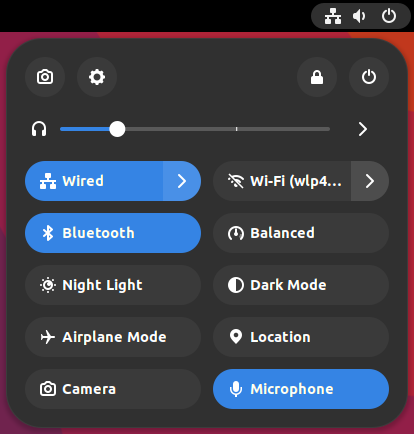

  

## Privacy Quick Settings Menu GNOME Extension

  - Add privacy quick settings to the system menu for quick access to privacy settings in GNOME
  - Supports GNOME 3.38+, earlier versions are untested
  - Get the extension from [here](https://extensions.gnome.org/extension/4491/privacy-settings-menu/)
  - This project is licensed under GPL 3.0
  - Any donations are greatly appreciated :)

## Why are apps ignoring my settings?
 - Due to limitations in GNOME shell, only sandboxed (flatpak / snap) apps can be forced to respect privacy settings
 - As long as the settings changed by the extension match the settings inside GNOME Settings (privacy section), the extension is behaving correctly

## Install the extension from releases:
  - Extract the zip to `~/.local/share/gnome-shell-extensions/PrivacyMenu@stuarthayhurst/`
    - Alternatively: `gnome-extensions install "PrivacyMenu@stuarthayhurst.shell-extension.zip" --force`
  - Reload GNOME: <kbd>ALT</kbd>+<kbd>F2</kbd>, <kbd>r</kbd>, <kbd>ENTER</kbd>
  - Enable the extension: `gnome-extensions enable PrivacyMenu@stuarthayhurst`

## Install the extension from source:
  - Make sure the install dependencies are installed
  - `make build`
  - `make install`
  - Reload GNOME: <kbd>ALT</kbd>+<kbd>F2</kbd>, <kbd>r</kbd>, <kbd>ENTER</kbd>
  - Enable the extension: `gnome-extensions enable PrivacyMenu@stuarthayhurst`

## Build system usage:
  - ### Common targets: Regular build system targets to build, install and uninstall
    - `make build`: Creates extension zip
    - `make check`: Runs checks on built extension zip
    - `make install`: Installs the extension
    - `make uninstall`: Uninstalls the extension
  - ### Development targets: These targets are aimed at developers and translators
    - `make clean`: Deletes extension zip
    - `make translations`: Updates translations
    - `make gtk4`: Simplifies and converts UI files (Should be run after any changes to files in `ui/`)
    - `make prune`: Removes rubbish from any .svgs in `docs/`
    - `make compress`: Losslessly compresses any .pngs in `docs/`
    - `make release`: Updates the UI, translations and icons, then creates and checks an extension zip

## Install dependencies:
  - gettext
  - gnome-extensions
  - libglib2.0-bin

## Build dependencies: (Only required if running `make release`)
  - `All install dependencies`
  - sed (`make translations`)
  - python3 (`make prune`)
  - libgtk-3-bin (`make gtk4`)
  - libgtk-4-bin (`make gtk4`)
  - optipng (`make compress`)

## Want to help?
  - Help with the project is always appreciated, refer to `docs/CONTRIBUTING.md` to get started
  - Documentation, code changes and translations are always welcome!
  - [Documentation](docs/CONTRIBUTING.md#documentation-changes), [code](docs/CONTRIBUTING.md#code-changes) and [translations](docs/CONTRIBUTING.md#translations) are always welcome!

## Bug reporting / debugging:
  - A live feed of GNOME's logs can be accessed with `journalctl /usr/bin/gnome-shell -f -o cat`
  - If the extension is crashing, an output from this is very helpful for fixing it

### Credits:
  - `scripts/update-po.sh` and `scripts/update-pot.sh` were derived from [Fly-Pie](https://github.com/Schneegans/Fly-Pie), originally licensed under the [MIT license](https://github.com/Schneegans/Fly-Pie/blob/develop/LICENSE)

### Screenshot:

